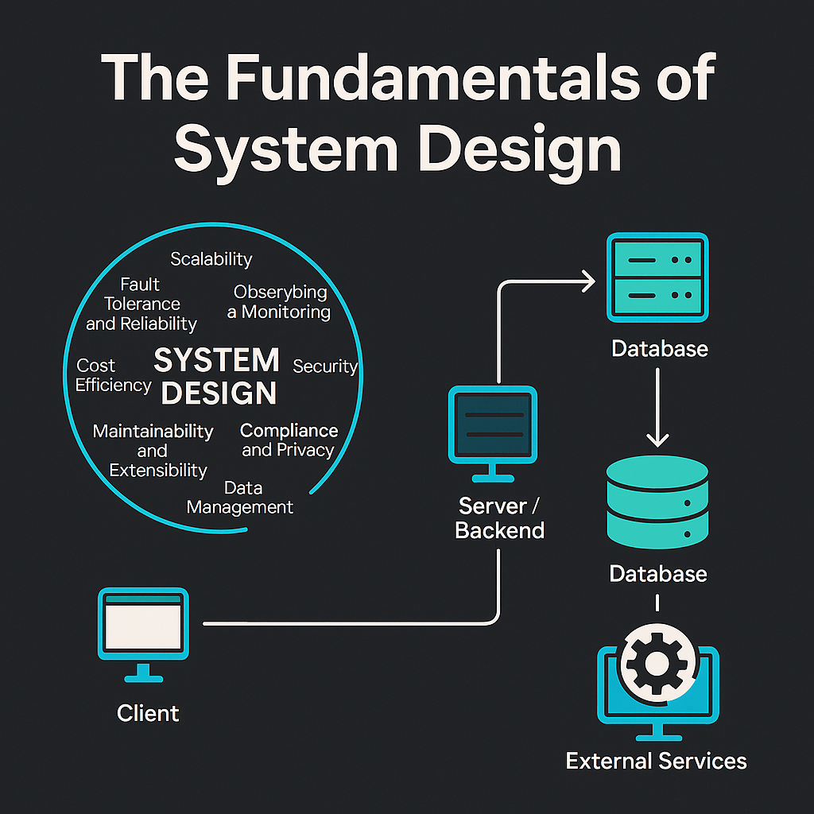

# System Design Guide

A comprehensive web application for learning and applying system design principles, built with React, TypeScript, and Tailwind CSS.

**Live Demo**: [https://system-design-guide.netlify.app/](https://system-design-guide.netlify.app/)



## Overview

The System Design Guide is an educational resource that helps software engineers, architects, and technical leaders understand and apply system design concepts. The application provides structured content on system design fundamentals, frameworks, and best practices.

## Features

- **Fundamentals of System Design**: Learn core concepts and principles
- **System Design Framework**: Step-by-step methodology for designing systems
- **Interactive UI**: Modern, responsive interface with dark mode support
- **Multilingual Support**: Content available in multiple languages (English, Portuguese, Spanish)
- **Comprehensive Topics**: Covers scalability, performance, reliability, and more

## Pages

1. **Home Page**: The Fundamentals of System Design
   - What is System Design?
   - 10 Key Questions in System Design
   - Understanding the Building Blocks
   - The System Design Process

2. **System Design Framework**: Structured approach to system design
   - Framework steps
   - Resources and tools
   - Practical examples

## Tech Stack

- **Frontend**: React with TypeScript
- **Styling**: Tailwind CSS
- **Icons**: Lucide React
- **Internationalization**: react-i18next
- **Routing**: React Router

## Getting Started

### Prerequisites

- Node.js (v14 or higher)
- npm or yarn

### Installation

1. Clone the repository:
   ```bash
   git clone https://github.com/yourusername/system-design-guide.git
   cd system-design-guide
   ```

2. Install dependencies:
   ```bash
   npm install
   # or
   yarn install
   ```

3. Start the development server:
   ```bash
   npm run dev
   ```

4. Open your browser and navigate to `http://localhost:5173`

## Project Structure

```
system-design-guide/
├── public/
│   ├── assets/
│   └── index.html
├── src/
│   ├── components/
│   │   ├── Content/
│   │   │   ├── HomePage.tsx
│   │   │   └── SystemDesignFrameworkPage.tsx
│   │   └── Layout/
│   │       ├── Sidebar.tsx
│   │       └── ...
│   ├── i18n/
│   │   └── locales/
│   │       ├── en.json
│   │       ├── pt.json
│   │       └── es.json
│   ├── App.tsx
│   └── index.tsx
└── README.md
```

### Theming

The application supports light and dark modes using Tailwind CSS. Theme settings can be adjusted in the `tailwind.config.js` file.

## Contributing

Contributions are welcome! Please feel free to submit a Pull Request.

1. Fork the repository
2. Create your feature branch (`git checkout -b feature/amazing-feature`)
3. Commit your changes (`git commit -m 'Add some amazing feature'`)
4. Push to the branch (`git push origin feature/amazing-feature`)
5. Open a Pull Request

## License

This project is licensed under the MIT License - see the LICENSE file for details.

## Acknowledgments

- Icons provided by [Lucide](https://lucide.dev/)
- UI components styled with [Tailwind CSS](https://tailwindcss.com/)
